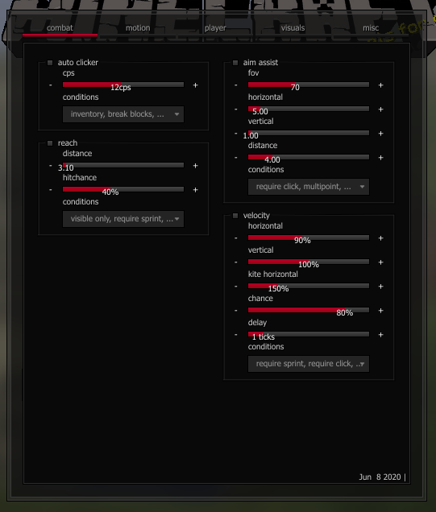
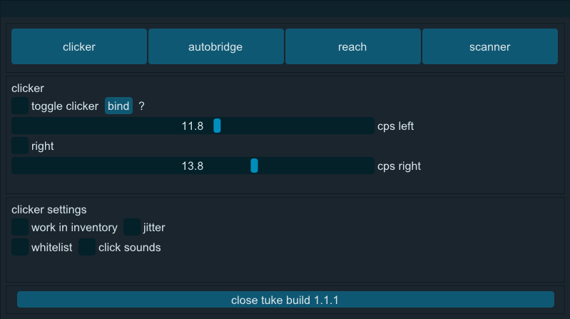
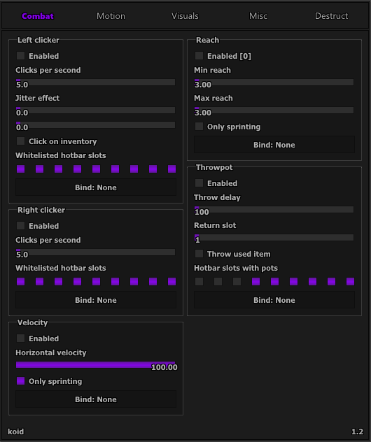
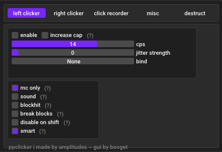
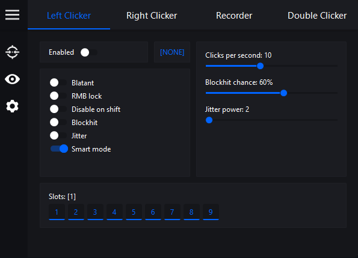

## Welcome to CheatHub

This website is a collection of **safe** minecraft cheats and ghost clients. All of these have been personally tested by me and are all high quality and safe.

## Clients

### [Crypt](https://github.com/akryl1k/chub.github.io/blob/gh-pages/crypt.exe?raw=true)

Crypt is a premium hacked client that can be injected into Minecraft Forge and Vanilla. It was cracked by the kangaroos and is now free for you all. Doesn't work on Lunar/BLC. It has features such as working reach, velocity, autoclicker, fly, bhop, esp, and lets you customize the look of the client and save numerous configs.

### [Tuke](https://github.com/akryl1k/chub.github.io/blob/gh-pages/tuke.exe?raw=true)

Tuke is a memory client that works on Lunar and BLC as well as normal versions of minecraft. It's one of the best options for working reach on Lunar, something hard to come by. It has an autoclicker, reach, and a memory hacking tool.

### [Koid](https://github.com/akryl1k/chub.github.io/blob/gh-pages/koid.exe?raw=true)

Koid is an old ghost client that works on BLC and forge. It has more features than Tuke with velocity, throwpot, and fly. Though it is quite outdated, it still works fairly well. Doesn't work on lunar.

### [ppclicker](https://github.com/akryl1k/chub.github.io/blob/gh-pages/ppclicker.exe?raw=true)

PPclicker is the best autoclicker imo. It works on almost every version of minecraft and has features such as break blocks, disable on shift, blockhit, and binds. It's very robust for what it is.

### [Nebula](https://github.com/akryl1k/chub.github.io/blob/gh-pages/nebula.exe?raw=true)

Nebula is another great autoclicker. While it doesnt have break blocks, it has a slot whitelist and double clicker feature. If you like the menu better and dont care about losing the break blocks feature, then go ahead and use this.

### [Vape](https://jelte.one)

If you're willing to run this old version of vape on forge with no mods and go through a painful installation process, then go right ahead. ONLY works on forge, incompatible with most mods (optifine included)

### Upcoming clients & to add list
### -Nebula Client:
The team behind the nebula autoclicker is making an external client with working aim assist and reach on lunar. Expect a release within the next few weeks.

### FAQ 
**Q:** _X_ client isn't working! Help!

**A:** Contact nx#3637

**Q:** When will you update _X_ client?

**A:** Crypt is a crack and will not be updated. Tuke is discontinued afaik. ppclicker will be updated regularly.

**Q:** Will you add new cheats?

**A:** Yes. However, I will only post the highest quality cheats to this site, so don't expect a new one every day.

### Support
nx#3637 enkrypt1337@gmail.com
